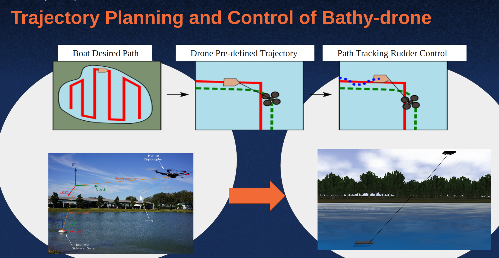

Time affiliated: Aug. 2023 - June 2024

Mechanical and Aerospace Engineering \\
University of Florida

PI: Peter Ifju \\
Co-PI: Jane Shin

Project Description
======
The Bathy-drone consists of a vessel equipped with sonar and camera sensors towed by an autonomous drone via a tether. This novel system enables cheap and efficient bathymetry of underwater areas that can be initiated from any point on land, and which does not get stuck in the water from floating vegetation due to the no-propeller design of the boat.

Responsibilities
======
The system's complex kinematics led to the boat not following the pre-defined trajectory exactly, so a pair of rudders were installed to help the boat steer itself back on track. I helped write Python code that controlled the rudders, either manually or via the Stanley Controller, and helped evaluate this controller during field tests. Moreover, I conducted research on rudder dynamics to develop a simulation of the system in Gazebo to help enable faster testing and development.

